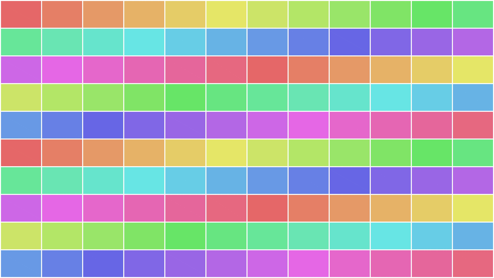

# Image Grid Maker

> Turn thousands of photos (e.g. photogrammetry captures) into a single, clean
> grid image — always a perfect square or rectangle, no empty cells.


*Example output grid:*



---

## What the app does

Image Grid Maker scans one or more folders of images and composites a chosen
number of them into one large grid. It is built for big photo sets (thousands of
files) and does the tedious parts for you:

- **Finds and groups by aspect ratio.** After scanning it lists every aspect
  ratio present with photo counts. You pick which to include; photos of other
  shapes are **centre-cropped** to a single cell ratio so the grid stays uniform.
- **Smart ordering.** Photos are sorted by sub-folder, then by **Date Taken** (EXIF), falling back to file name. Sub-folders can be ordered by **name, creation date, or random**, ascending or descending.
- **Mixed orientation (v1.0.1).** Optionally keep portrait photos too: two portraits share one landscape slot (split by a single border), so the grid stays a perfect rectangle with uniform borders.
- **Pick how many and how.** Use the first *N* photos, or sample **evenly** across
  the whole set.
- **Exact grid, every time.** You give a target output aspect ratio (e.g. 16:9)
  and the app computes the closest rows × columns with **no empty cells**.
- **Uniform resolution.** You set the final image **width in pixels**; every cell
  is rendered at the same size regardless of the source resolution.
- **Output options.** JPEG (with quality) or PNG, an optional coloured border, and an exact-fit toggle to force the precise output size.
- **Fast.** Scanning and rendering run across multiple CPU cores (default 80%).
- **Convenient UI.** Drag-and-drop folders, a live layout preview, per-section
  help (`?`) buttons, and a log panel.

---

## Requirements

- **Windows** with **Python 3.8+** (Tkinter is included with the standard
  Python installer).
- Python packages: **Pillow** and **tkinterdnd2** (see `requirements.txt`).

```bash
pip install -r requirements.txt
```

> If `tkinterdnd2` is missing the app still runs, but folder drag-and-drop is
> disabled (a hint is shown instead).

---

## Installation

### Option A — Download and run (recommended)

Download the latest **`ImageGridMaker.exe`** from the
[**Releases**](https://github.com/taskinc/image-grid-maker/releases) page and
double-click it. No Python needed.

> On first launch Windows SmartScreen may warn about an unsigned app — choose
> *More info → Run anyway*.

### Option B — Run from source

```bash
pip install -r requirements.txt
python image_grid_maker.py
```

### Building the .exe yourself (optional)

```bash
pip install -r requirements.txt pyinstaller
pyinstaller --clean --onefile --windowed --name ImageGridMaker ^
  --collect-all tkinterdnd2 image_grid_maker.py
```

## Usage

1. **Source folders** — drag folders onto the window, or click *Add folder*.
   Sub-folders are included by default.
2. **Scan & analyse** — reads every image and groups it by aspect ratio.
3. **Aspect ratios** — tick the ratios to include and choose the one ratio to
   *crop all included photos to* (the most common ratio is pre-selected).
4. **Photo selection** — set how many photos, and *First N* vs *Evenly spaced*.
5. **Output layout** — type the target aspect ratio; the app shows the exact grid.
6. **Resolution & format** — set the output width (px), and JPEG/PNG + quality.
7. **Border** — optional width (0 = none) and colour.
8. **Performance** — the percentage of CPU cores to use.

Then click **Generate grid…**. Every group has a **?** button explaining its
options, and the **Log** panel records each step.

---

## Files

| File | Purpose |
|------|---------|
| `image_grid_maker.py` | The GUI application (run this). |
| `image_grid_core.py`  | Image/scan/grid logic (imported by the app). |
| `test_image_grid_core.py` | Headless tests for the core logic. |
| `requirements.txt` | Python dependencies. |

## Tests

```bash
pip install pillow piexif
python test_image_grid_core.py
```

---

## Version

**1.0.1**

- Added folders are expanded into every image-containing sub-folder, each listed
  separately. "Order folders by" (name / creation date / random, asc/desc)
  re-sequences the whole list; picking Random again reshuffles.
- Mixed landscape + portrait mode (two portraits per slot, borders stay aligned).
- Photo selection now has "Use all available photos" (default).
- "Preview structure..." opens a separate window showing the grid's cells,
  borders and portrait splits, with an adjustable preview border width (black, default 1px; scales to any photo count).
- "Fit output exactly to width x aspect ratio" option for a pixel-exact result.
- Robust on huge photo sets: big JPEGs are decoded at reduced scale (much lower memory, so cells no longer drop out), truncated files are tolerated, and the large-image guard is lifted.
- About box with version and repo link.

**1.0.0** — first public release.

- Folder scanning with parallel metadata read
- Aspect-ratio grouping + crop-to-ratio
- Date-aware sorting, first-N / evenly-spaced selection
- Exact-rectangle grid for any target aspect ratio
- Output-width sizing with uniform cells
- JPEG/PNG, optional border, multi-core rendering
- Drag-and-drop, help buttons, log panel, About box

---

## License

Released under t